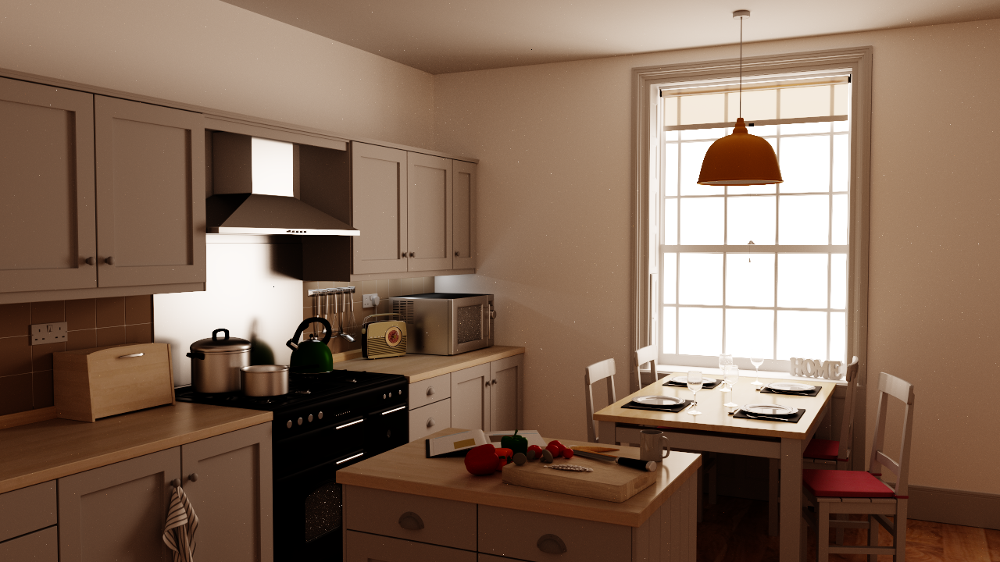
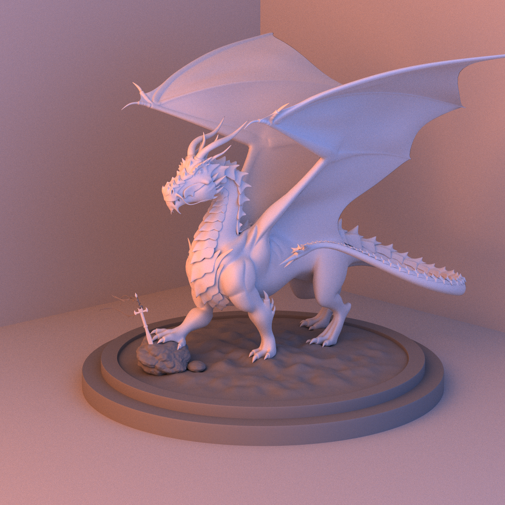
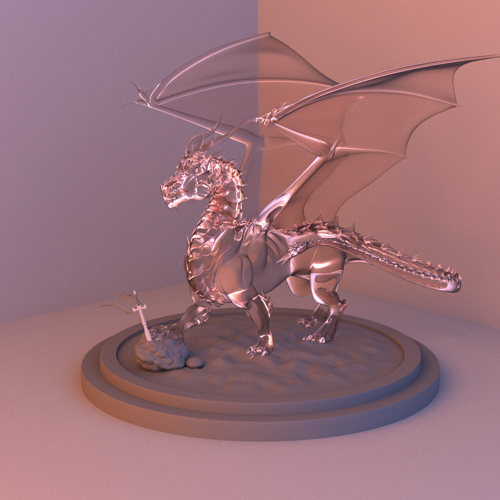

# EasyRender
This renderer is developed based on the OptiX 8.0 architecture. It supports for pbrt-v3 scene formats and Disney Principled Materials. We also implemented physically based ray tracing algorithms including path tracing and bidirectional path tracing to render high-quality images in multiple scenes. 

## Dependencies
+ [spdlog](https://github.com/gabime/spdlog), please specify `-DSPDLOG_USE_STD_FORMAT` when built with CMake. 
+ [re2](https://github.com/google/re2)
+ [glm](https://github.com/g-truc/glm)
+ OptiX, CUDA for OptiX backend.

We also provide `vcpkg.json` for those who use vcpkg as package manager, but you may specify cmake options yourself when you install packages.

## Gallery

